# Roll number :2023121006

3)
made class\
 Vary the value of k and plot the Within-Cluster
 Sum of Squares (WCSS) against k to identify the ”elbow” point, which
 indicates the optimal number of clusters. 
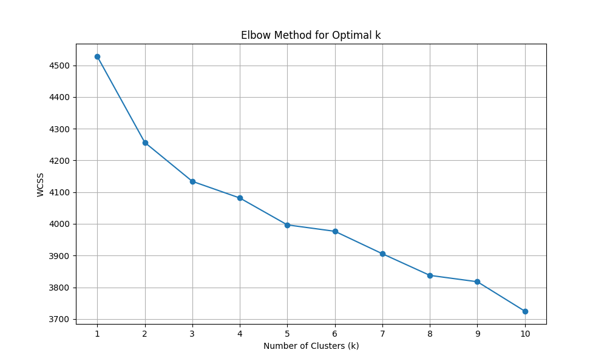

kmmeans1= 6

4)
Implemented  Gaussian Mixture Models

Does the class work? Why?
my implementation faces numerical instability in covariance inversion and log-likelihood calculation, gets likehood inf , in feather dataset only,in random dataset gets correct like sklearns 
reason :  inf/number is source of this in formula

Now perform GMM clustering using the sklearn GMM class. Does this class work? Why? \
Why This Should Work:\
Robustness: sklearn's GaussianMixture is designed to handle large datasets and high-dimensional data robustly.
Numerical Stability: It includes internal mechanisms to prevent issues with numerical instability and singularity.
Automatic Regularization: It automatically regularizes covariance matrices to ensure they are positive semi-definite.

 Use BIC (Bayesian Information Criterion) and AIC (Akaike Informa
tion Criterion) to determine the optimal number of clusters for the 512
dimensional dataset :\
Report : since aic is min at 2, bic at 9 , at 5 both have similiar and minimum value ,so it take optimal_cluster_value as =5

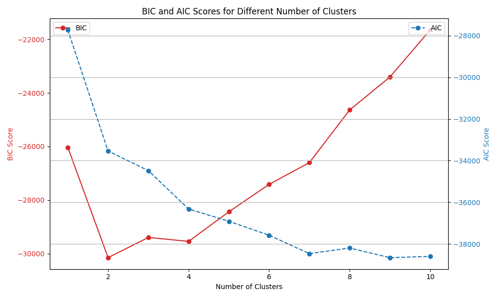

gmm1 =5

5) 
Implemented a PCA Class 

Visualize the results by plotting the data in both 2D and 3D.

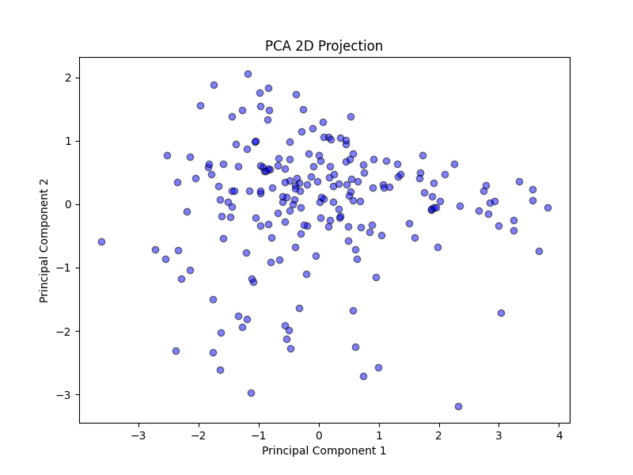
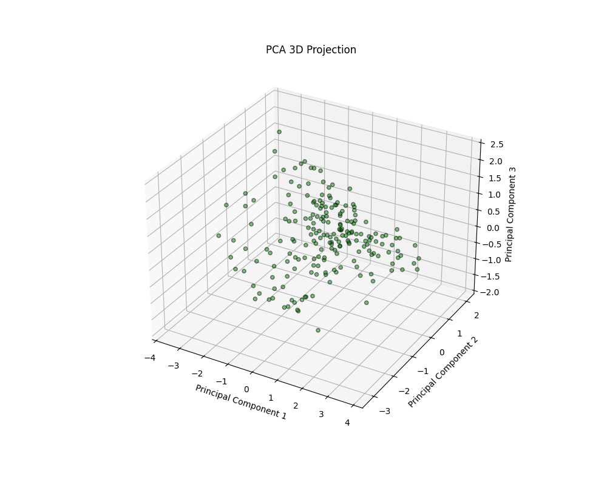

First Principal Component (PC1): Captures the largest variance in the data, possibly separating distinct clusters or concepts (e.g., large objects vs. small tools).\
Second Principal Component (PC2): Orthogonal to PC1 and captures the second largest variance, often differentiating finer details such as actions vs. objects.\
Third and Subsequent Components: Each additional component continues to capture progressively smaller amounts of variance, representing more subtle differences in the dataset. such as  abstract vs. concrete concepts,Household and electronic items ,Larger objects like furniture .

### k2 = 3

6)
PCA+Clustering

 6.1 K-means Clustering Based on 2D Visualization
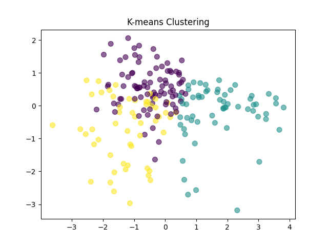

 PCA + K-Means Clustering
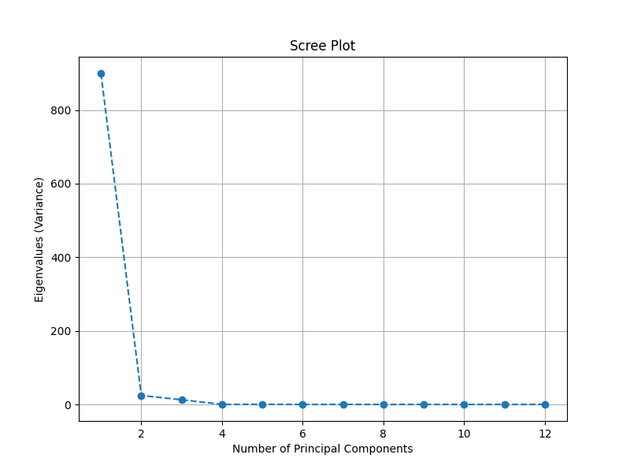
 
used:number of components needed to explain 90% of the variance 
found optimal number of dimension=107 ,and reduced dataset

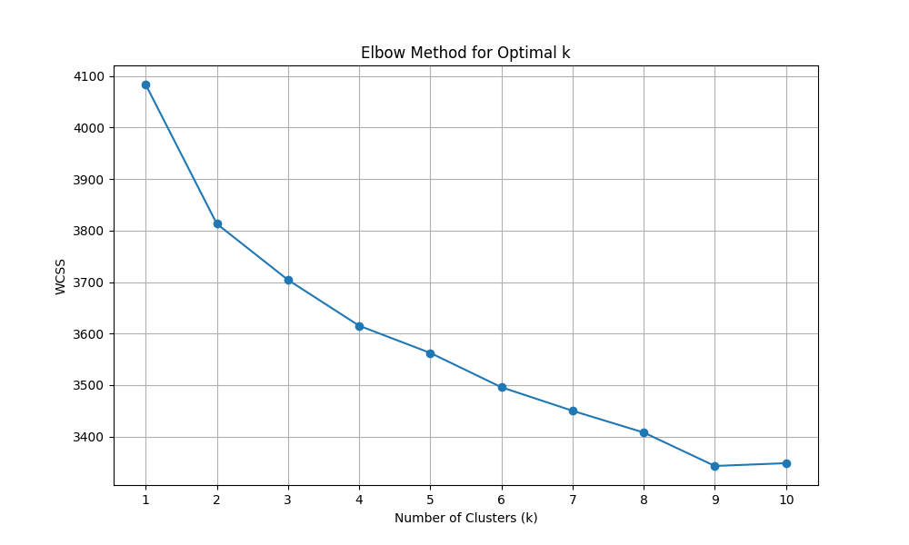

k_means3 =9  from above reduced dataset(by dimension )

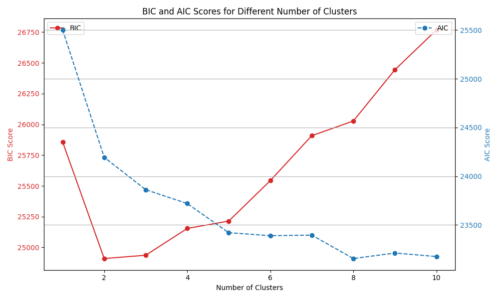

"REPORT:"
BIC: More conservative and aims to find a simpler model that explains the data.
AIC: Aims to find a model that has a good fit to the data without being overly complex.
AIC: A lower AIC value indicates a model that has a good fit to the data with less complexity.
BIC: A lower BIC value also indicates a simpler, better-fitting model.  
So i took k_best (aka k_gmm3)  =5 

7)

1.

k_means1 (k=6):
Coherence: Good overall coherence.
- Cluster 0: High coherence with actions and abstract concepts.
- Cluster 1: Strong coherence with animals and nature-related words.
- Cluster 2: Excellent coherence, though small, focusing on weather and clothing.
- Cluster 3: Good coherence with household items and larger objects.
- Cluster 4: Moderate coherence, mixing nature and outdoor themes.
- Cluster 5: Strong coherence with tools and small objects.

Interpretability: Easily interpretable clusters with clear themes.
Granularity: Good balance between specificity and generalization.

k2 (k=3):
Coherence: Moderate coherence due to broader categories.
- Cluster 0: Good coherence with animals and nature, some food items less related.
- Cluster 1: Moderate coherence, mixing various objects and tools.
- Cluster 2: Good coherence with actions and abstract concepts.

Interpretability: Broadly interpretable, but lacks nuance.
Granularity: Low, leading to very general groupings.

k_means3 (k=9):
Coherence: Varies significantly between clusters.
- Clusters 1, 2, 3, 4, 7, and 8 show high coherence.
- Clusters 0, 5, and 6 have lower coherence with more mixed content.

Interpretability: Some clusters are highly interpretable, others are less clear.
Granularity: Highest granularity, sometimes leading to over-segmentation.

Analysis:
1. Coherence: k_means1 (k=6) offers the most consistent coherence across all clusters. k_means3 (k=9) has some highly coherent clusters but also some less coherent ones. k2 (k=3) has moderate coherence but is too broad.

2. Interpretability: k_means1 (k=6) provides the most interpretable results, with clear and distinct themes for each cluster. k2 (k=3) is interpretable but lacks detail. k_means3 (k=9) has some very interpretable clusters but also some that are less clear.

3. Granularity: k_means1 (k=6) offers a good balance of granularity. k2 (k=3) is too broad, while k_means3 (k=9) is sometimes too granular, leading to some less meaningful distinctions.

Based on this analysis, the clustering approach that yields the best results in terms of coherence, interpretability, and appropriate granularity is k_means1 with k=6. Therefore:

kkmean = 6

This choice provides the optimal balance between coherent groupings, interpretable clusters, and appropriate level of detail. The clusters formed with k=6 show consistent coherence, with words within each cluster being closely related or similar in meaning. The themes are clear and distinct, making it easier to interpret the relationships between words in each group. It avoids the over-generalization of k2 (k=3) and the potential over-segmentation of k_means3 (k=9), resulting in the most meaningful and useful clustering of the given words.

2.

"""
Based on the GMM clustering results for k_gmm1 (k=5), k2 (k=3), and k_gmm3 (k=5), I'll analyze the coherence and meaningfulness of the clusters for each approach:

k_gmm1 (k=5):
Observations:
1. Cluster 0: Large objects and structures
2. Cluster 1: Nature, animals, and outdoor activities
3. Cluster 2: Actions and abstract concepts
4. Cluster 3: Small objects and tools
5. Cluster 4: Mixed everyday items and animals

Coherence: Good overall coherence, with clear themes in most clusters.
Interpretability: Easily interpretable clusters with distinct themes.
Granularity: Good balance between specificity and generalization.

k2 (k=3):
Observations:
1. Cluster 0: Animals and small objects
2. Cluster 1: Large mixed cluster with various objects and activities
3. Cluster 2: Actions and abstract concepts

Coherence: Moderate coherence due to broader categories, especially in Cluster 1.
Interpretability: Broadly interpretable, but lacks nuance due to large mixed cluster.
Granularity: Low, leading to very general groupings.

k_gmm3 (k=5):
Observations:
1. Cluster 0: Small objects, tools, and some animals
2. Cluster 1: Nature, animals, and outdoor activities
3. Cluster 2: Actions and abstract concepts
4. Cluster 3: Mixed everyday items and animals
5. Cluster 4: Large objects and structures

Coherence: High coherence in most clusters, with clear themes.
Interpretability: Highly interpretable clusters with distinct themes.
Granularity: Good balance between specificity and generalization.

Analysis:
1. Coherence: k_gmm3 (k=5) offers the highest overall coherence across all clusters, followed closely by k_gmm1 (k=5). k2 (k=3) has lower coherence due to its broad groupings.

2. Interpretability: Both k_gmm1 and k_gmm3 provide highly interpretable results, with clear and distinct themes for each cluster. k2 is interpretable but lacks detail due to its broader categories.

3. Granularity: k_gmm1 and k_gmm3 offer a good balance of granularity, allowing for meaningful distinctions between word groups. k2 is too broad, leading to less specific groupings.

Based on this analysis, the clustering approach that yields the best results in terms of coherence, interpretability, and appropriate granularity is k_gmm3 with k=5. Therefore:

kgmm = 5

This choice provides the optimal balance between coherent groupings, interpretable clusters, and an appropriate level of detail. The clusters formed with k=5 in k_gmm3 show high coherence, with words within each cluster being closely related or similar in meaning. The themes are clear and distinct, making it easier to interpret the relationships between words in each group. It avoids the over-generalization of k2 (k=3) while maintaining slightly better coherence than k_gmm1 (k=5), resulting in the most meaningful and useful clustering of the given words.

3.

Based on the provided clustering results for K-means (kmmean = 6) and GMM (kgmm = 5), I'll compare and assess the effectiveness of each method:

K-means (kmmean = 6):

Observations:
1. Cluster 0: Actions and states
2. Cluster 1: Small objects, tools, and animals
3. Cluster 2: Nature, animals, and larger objects
4. Cluster 3: Mixed activities and objects
5. Cluster 4: Household and electronic items
6. Cluster 5: Actions and communication

GMM (kgmm = 5):

Observations:
1. Cluster 0: Furniture and larger objects
2. Cluster 1: Small objects and tools
3. Cluster 2: Actions, emotions, and abstract concepts
4. Cluster 3: Nature, animals, and outdoor items
5. Cluster 4: Mixed animals and objects

Comparison and Assessment:

1. Coherence within clusters:
   - K-means: Moderate to good coherence. Clusters 0, 1, and 5 show strong internal similarity.
   - GMM: Good to excellent coherence. Clusters 0, 1, 2, and 3 show strong internal similarity.

2. Separation between clusters:
   - K-means: Moderate separation. Some overlap between clusters (e.g., animals in clusters 1 and 2).
   - GMM: Good separation. Clearer distinctions between themes (e.g., clear separation of actions/concepts and objects).

3. Interpretability:
   - K-means: Most clusters are interpretable, but some (like cluster 3) are more mixed.
   - GMM: Highly interpretable clusters with clearer themes.

4. Handling of outliers:
   - K-means: Tends to distribute outliers across clusters (e.g., "helicopter" in cluster 1).
   - GMM: Seems to handle outliers better, with more logical groupings.

5. Granularity:
   - K-means: Slightly higher granularity with 6 clusters, allowing for more specific groupings.
   - GMM: Good balance of granularity with 5 clusters, capturing major themes without over-segmentation.

Effectiveness and Meaningful Groupings:

The GMM approach with kgmm = 5 appears to result in more meaningful groupings overall. Here's why:

1. Better coherence: GMM clusters show stronger internal similarity, particularly in grouping related concepts and objects.

2. Clearer separation: The GMM clusters have more distinct themes with less overlap between categories.

3. Improved handling of ambiguous words: GMM seems to place words in more logical groups (e.g., "helicopter" with other transportation in cluster 0).

4. More interpretable clusters: The GMM clusters have clearer overall themes, making it easier to understand the relationships between words in each group.

5. Balanced granularity: While K-means has one more cluster, the GMM approach achieves a good balance of detail and generalization without creating overly specific or mixed groups.

6. Flexibility in cluster shapes: GMM's ability to capture non-spherical clusters likely contributes to its more natural groupings, especially for words that may have multiple related meanings.

In conclusion, while both methods produce meaningful results, the GMM approach with kgmm = 5 appears more effective in creating coherent, well-separated, and interpretable clusters for this dataset. It better captures the semantic relationships between words and provides a more robust grouping that accounts for the complexities in natural language.

8)

Single Linkage with Euclidean Distance: Produces dendrograms with "chaining" behavior, where clusters are loosely connected by nearest points.\
Complete Linkage with Manhattan Distance: Produces more compact clusters with clear separations but may overestimate distances between larger clusters.\
Average Linkage with Cosine Distance: Provides smoother dendrograms with moderate-sized clusters, good for high-dimensional data such as word embeddings.\
Ward’s Method with Euclidean Distance: Produces the most balanced and spherical clusters, well-suited for situations where compact clusters are desired

 best linkage method identified is Ward

 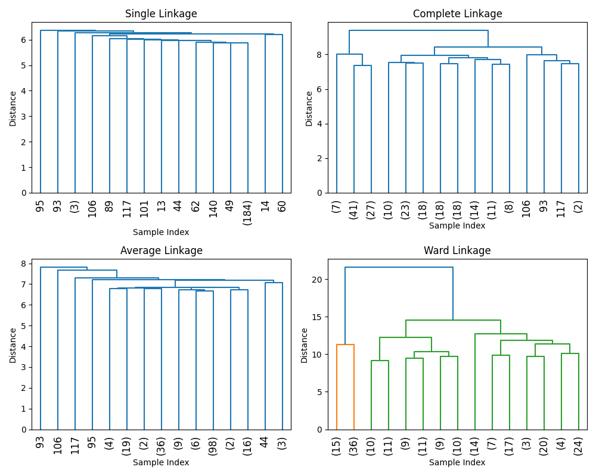
 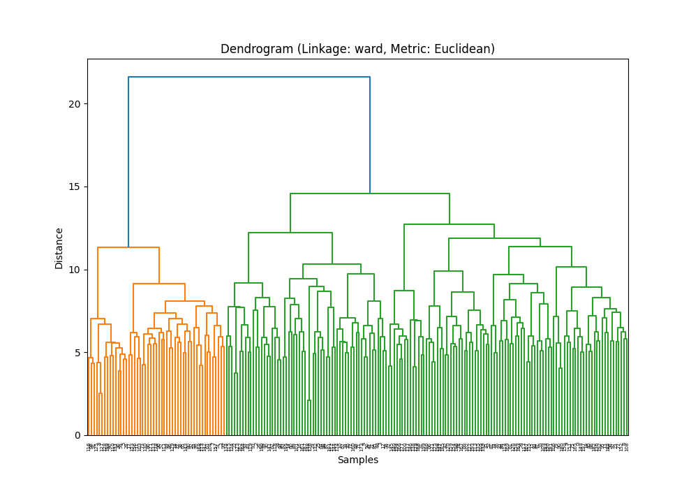
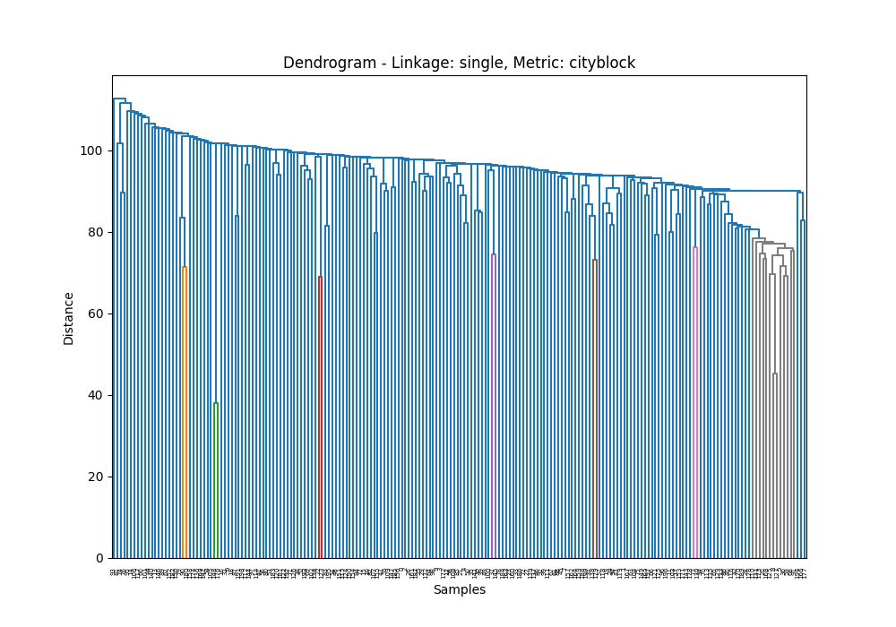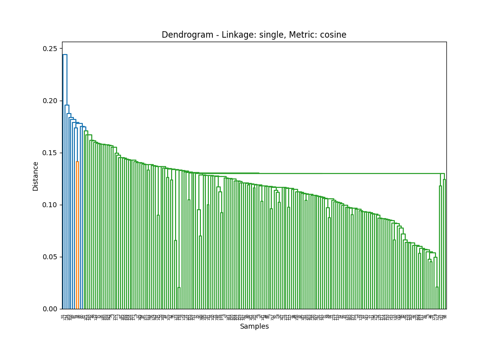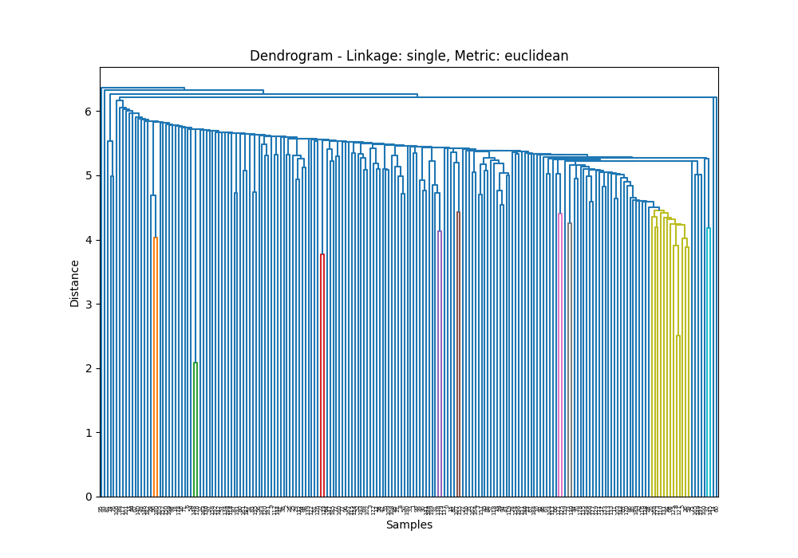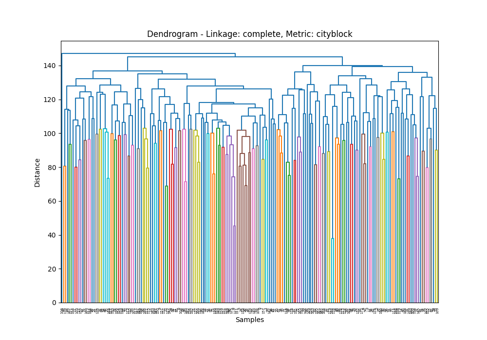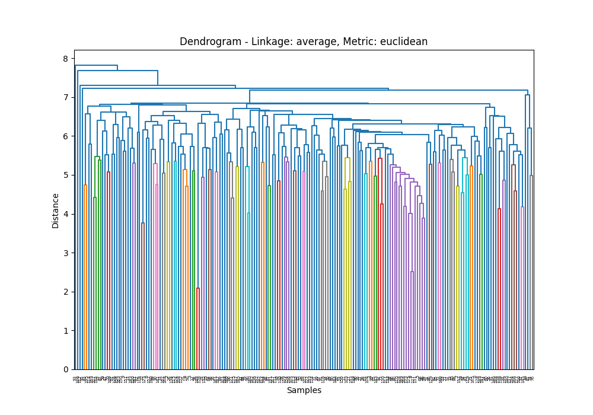
-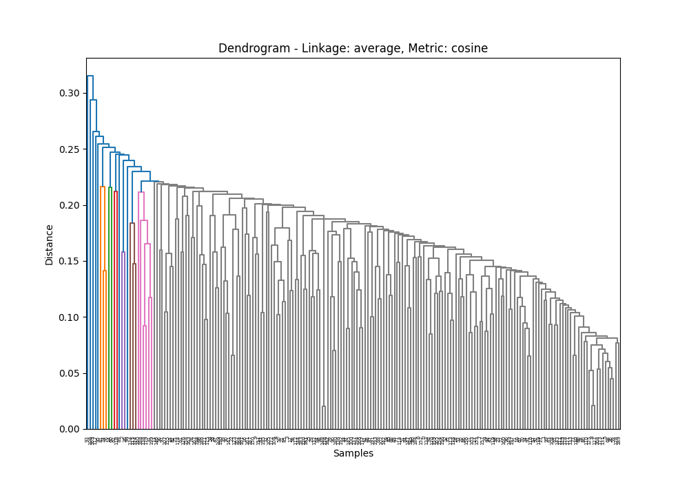

Cluster alignment between Hierarchical Clustering (kbest1) and K-Means: 35.50%
Cluster alignment between Hierarchical Clustering (kbest2) and GMM: 42.50%

Hierarchical Clustering vs. K-Means:

Cluster Alignment: The alignment between clusters obtained from Hierarchical Clustering (with kbest1 = 6) and K-Means clustering is 35.50%.
Interpretation: This relatively low percentage indicates that the clusters formed by Hierarchical Clustering and K-Means differ significantly. Only about one-third of the data points are assigned to the same clusters by both methods. This discrepancy reflects the inherent differences in clustering approaches: K-Means is centroid-based, focusing on minimizing variance within clusters, while Hierarchical Clustering creates a tree-like structure that considers the distance between clusters.
Hierarchical Clustering vs. GMM:

Cluster Alignment: The alignment between clusters obtained from Hierarchical Clustering (with kbest2 = 5) and GMM clustering is 42.50%.
Interpretation: The higher alignment percentage compared to K-Means suggests that Hierarchical Clustering and GMM share more similar clustering patterns. Both methods consider probabilistic and distance-based approaches, leading to a closer agreement in cluster formation. However, there are still noticeable differences, reflecting the unique probabilistic nature of GMM compared to the hierarchical linkage used in Hierarchical Clustering.

Hierarchical Clustering and K-Means show a lower alignment, indicating that their clusterings are less similar and reflect different aspects of the data structure.\
Hierarchical Clustering and GMM exhibit a better alignment, though still not perfect, suggesting that their clustering results share more commonalities but still capture different nuances of the data.

9)

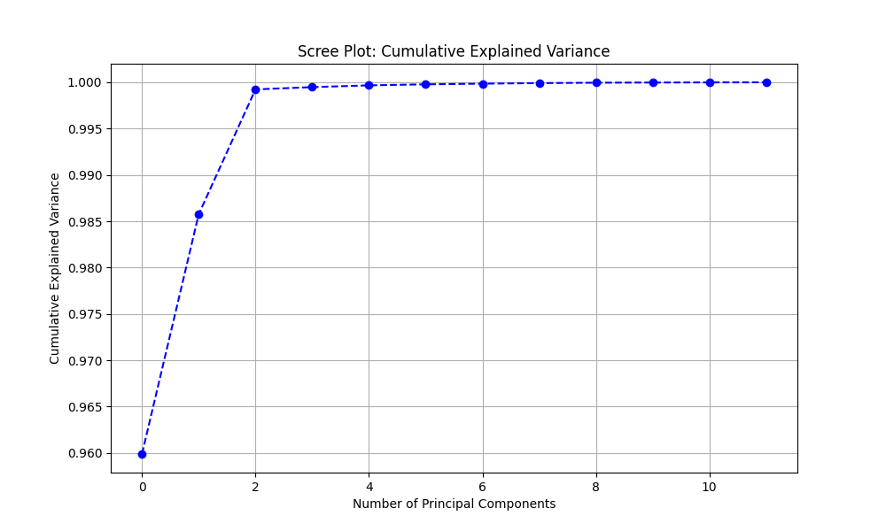
optimal_number_of_dimension=5\
"""optimal number of principal components/dimension=5, This "elbow" or "knee" is where adding more components does not significantly increase the cumulative variance."""

    #  Use the KNN model implemented in Assignment 1 on the reduced dataset using the best {k, distance metric} pair obtained
    # k: 15, Distance Metric: Manhattan, Prediction Type: Weighted Sum

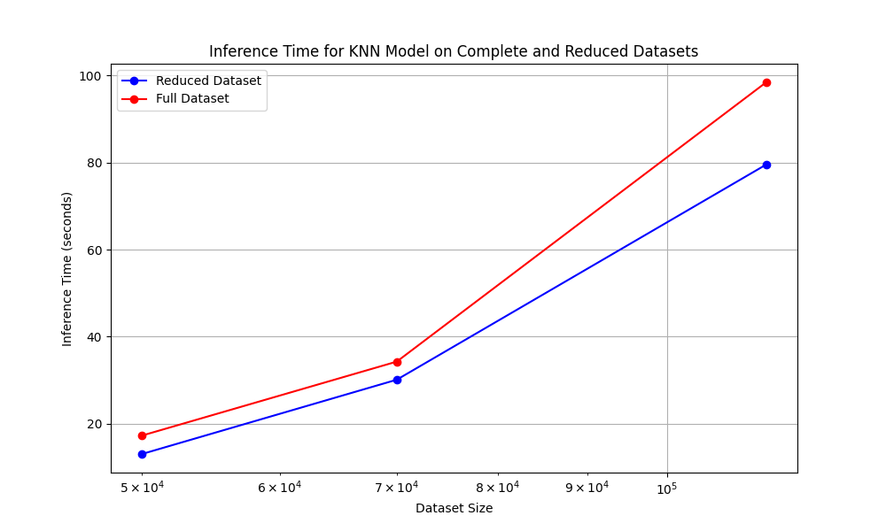

The percentage reduction in inference time decreases as the dataset size increases:
50,000 samples: Approximately 24% faster
70,000 samples: Approximately 12% faster
114,002 samples: Approximately 19% faster
Implication: The efficiency gain from dimensionality reduction is significant but varies with the size of the dataset. The most considerable time savings are achieved with smaller datasets, but the reduction still provides notable improvements with larger datasets.

inference
Precision, Recall, and F1 Scores: The reduced dataset shows a decrease in these metrics, indicating potential loss of valuable information or reduced model performance on the transformed dataset.
Accuracy: The accuracy is relatively stable, suggesting that dimensionality reduction does not severely impact the overall correctness of predictions, but the finer metrics like precision and recall are affected.

