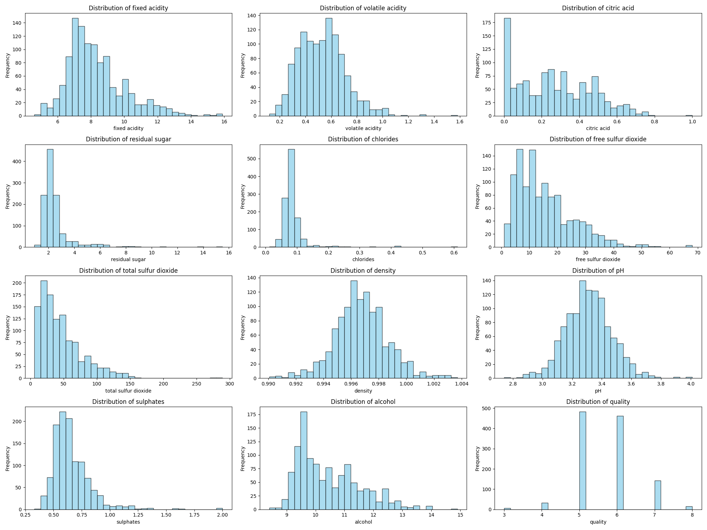
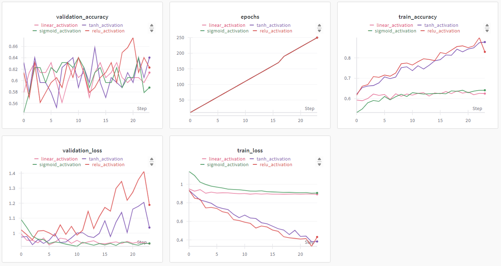
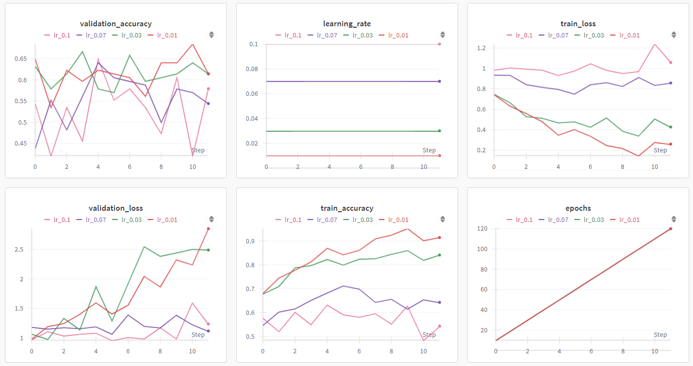
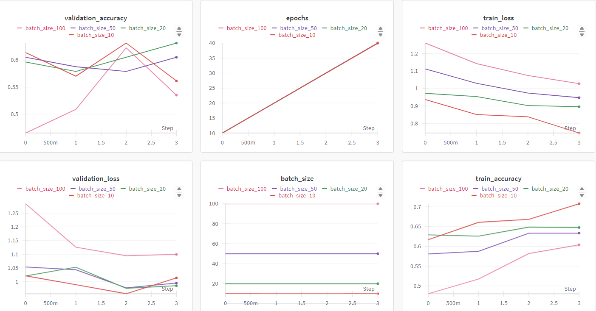
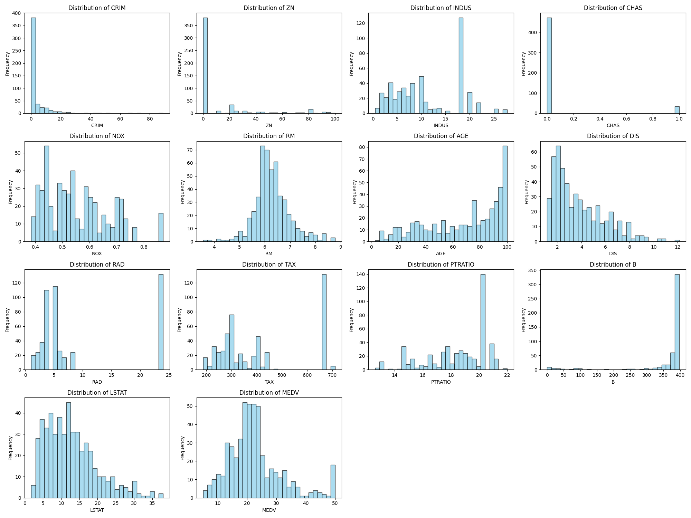
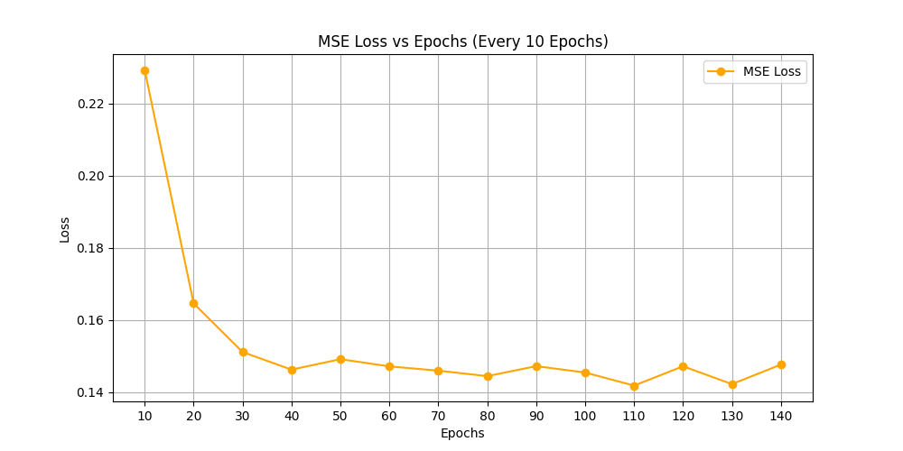
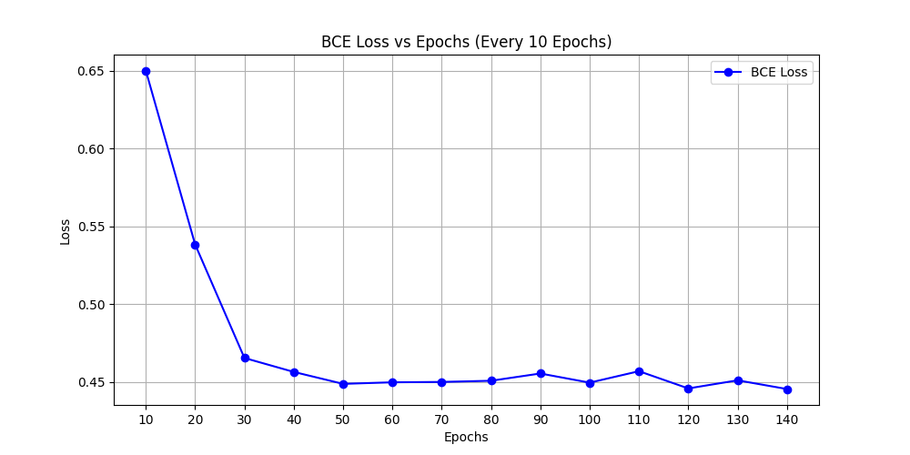
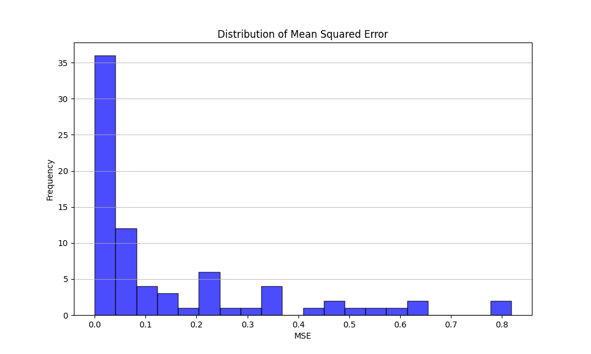

Task 2.4 (Single-Label Classification):

Output Activation: Softmax
Loss Function: Cross-Entropy Loss

Task 2.6 (Multi-Label Classification):

Output Activation: Sigmoid (one for each label)
Loss Function: Binary Cross-Entropy Loss

# Report Starts Here
## 2.1 Dataset Analysis and Preprocessing
Dataset Description:
| Feature               | Mean      | Std Dev   | Min      | Max      |
|-----------------------|-----------|-----------|----------|----------|
| Fixed Acidity          | 8.311111  | 1.747595  | 4.60000  | 15.90000 |
| Volatile Acidity       | 0.531339  | 0.179633  | 0.12000  | 1.58000  |
| Citric Acid            | 0.268364  | 0.196686  | 0.00000  | 1.00000  |
| Residual Sugar         | 2.532152  | 1.355917  | 0.90000  | 15.50000 |
| Chlorides              | 0.086933  | 0.047267  | 0.01200  | 0.61100  |
| Free Sulfur Dioxide    | 15.615486 | 10.250486 | 1.00000  | 68.00000 |
| Total Sulfur Dioxide   | 45.914698 | 32.782130 | 6.00000  | 289.00000|
| Density                | 0.996730  | 0.001925  | 0.99007  | 1.00369  |
| pH                     | 3.311015  | 0.156664  | 2.74000  | 4.01000  |
| Sulphates              | 0.657708  | 0.170399  | 0.33000  | 2.00000  |
| Alcohol                | 10.442111 | 1.082196  | 8.40000  | 14.90000 |
| Quality                | 5.657043  | 0.805824  | 3.00000  | 8.00000  |
| Id                     | 804.969379| 463.997116| 0.00000  | 1597.00000|

### Distribution of the various labels

## 2.2 Model Building from Scratch

For 100 epochs:
- **Gradient Check**: 0.0001244680163790105
- **Validation Accuracy**: 55.26%
- **Validation Loss**: 1.5932173897101973
- **Test Accuracy**: 53.04%
- **Test Loss**: 1.7880722586505897

## 2.3 Model Training & Hyperparameter Tuning using W&B

### 1) Plot the Trend of Accuracy Scores with Change in Hyperparameters using W&B

1. [Activation Curves] (https://wandb.ai/kk408-aissms-ioit/wine-quality-prediction-activation-curves)
2. [Optimizer Curves] (https://wandb.ai/kk408-aissms-ioit/wine-quality-prediction-optimizer-curves)
3. [Learning Rate Curves] (https://wandb.ai/kk408-aissms-ioit/wine-quality-prediction-learning-rate-curves)

### 2)Generate a table listing all the hyperparameters tested and their corresponding metrics mentioned above

ALL 94 sweeps, for best hyperparameter
https://wandb.ai/kk408-aissms-ioit/wine-quality-prediction

Table also saved at :"./assignments/3/hyperparamerter_tuning/hyperparameter_tuning_results.csv" 
[text](hyperparamerter_tuning/hyperparameter_tuning_results.csv)

### 3)Report the parameters for the best model that you get (for the various values you trained the model on). 
- **Best Validation Accuracy**: 
  - **Activation Function**: ReLU
  - **Epochs**: 100
  - **Hidden Layers**: [32, 32]
  - **Learning Rate**: 0.01
  - **Optimizer**: SGD

## 2.4 Evaluating Single-label Classification Model

- **Test Accuracy**: 0.5304
- **Test Precision**: 0.2527
- **Test Recall**: 0.2727
- **Test F1-Score**: 0.2550
- **Test Loss**: 4.3614

## 2.5 Analyzing Hyperparameters Effects

### 1. Effect of Non-linearity:
  Link :[Activation Curves](https://wandb.ai/kk408-aissms-ioit/wine-quality-prediction-activation-curves)

  

  **Effect of Non-linearity (Activation Functions):**

  Four activation functions were tested: linear, tanh, sigmoid, and ReLU.
  - ReLU and tanh performed best, achieving highest validation accuracy (0.64-0.66) and training accuracy (0.85-0.90).
  - Sigmoid showed the most stable validation loss, while ReLU and tanh indicated potential overfitting.
  - ReLU required significantly more epochs (250) compared to others (50).
  - Non-linear activations (ReLU, tanh, sigmoid) generally outperformed linear activation.
  
  #### Loss vs Epochs Analysis:

- All activation functions showed decreasing train loss over time.
- **ReLU** and **tanh** achieved the lowest train loss, followed by **linear** and then **sigmoid**.

**Validation Loss Behavior**:
- **Sigmoid** showed the most stable validation loss.
- **ReLU** and **tanh** had increasing validation loss over time, indicating potential overfitting.
- **Linear** activation showed high fluctuations in validation loss.

  **Conclusion**: ReLU and tanh were most effective for accuracy and convergence speed, but care is needed to prevent overfitting, especially with ReLU.

### 2. Effect of Learning Rate
  Link :[Learning Rate Curves](https://wandb.ai/kk408-aissms-ioit/wine-quality-prediction-learning-rate-curves)

  

  **Effect of Learning Rate:**

  Four learning rates were tested: 0.1, 0.07, 0.03, and 0.01.
  - Lower rates (0.03 and 0.01) showed the highest validation accuracy (0.63-0.67) and training accuracy (0.85-0.92).
  - Higher rates (0.1 and 0.07) converged faster but led to suboptimal solutions.
  - Lower rates required more epochs (120 for 0.01) compared to higher rates (20-40).
  - Lower rates showed signs of overfitting with increasing validation loss over time.
  
  #### Loss vs Epochs Analysis:

- All learning rates showed decreasing train loss over time.
- Lower rates (0.03 and 0.01) achieved lower train loss, with 0.01 performing slightly better.
- Higher rates (0.1 and 0.07) showed a slower decrease in train loss.

**Validation Loss**:
- Lower rates showed increasing validation loss over time.
- Higher rates had more stable but higher validation loss.

  **Conclusion**: 0.03 appeared to be optimal, balancing performance and training time. Early stopping or regularization is recommended for lower rates to combat overfitting.

### 3. Effect of Batch Size
  Link :[Batch Size Curves](https://wandb.ai/kk408-aissms-ioit/wine-quality-prediction-batch-size-curves)

 

  **Effect of Batch Size:**

  Four batch sizes were tested: 100, 50, 20, and 10.
  - Smaller sizes (10 and 20) showed higher validation accuracy (0.62-0.64) and training accuracy (0.70-0.72).
  - Smaller sizes provided more stable learning curves and better generalization.
  - Larger sizes required fewer epochs but led to suboptimal solutions.
  - Smaller sizes needed more epochs (40 for size 10) compared to larger sizes (10-20).
  
  ### Loss vs Epochs Analysis:

- All batch sizes showed decreasing train loss over time.
- Smaller batch sizes (10 and 20) achieved lower train loss more quickly.
- Larger batch sizes, especially 100, showed a slower decrease in train loss.

**Validation Loss**:
- Smaller batch sizes maintained lower and more stable validation loss.
- Larger batch sizes, especially 100, showed higher validation loss.

  **Conclusion**: A batch size around 20 seemed optimal, balancing performance and training efficiency. Smaller sizes performed better but potentially increased overall training time due to more epochs required.

## 2.6 Multi-Label Classification

1. **Model Class**: Created

2. **Evaluation Metrics**:
   - **Test Accuracy**: 66.25%
   - **Overall Accuracy**: 3.00%
   - **Precision**: 51.42%
   - **Recall**: 6.11%
   - **F1-Score**: 10.92%
   - **Hamming Loss**: 0.3375

3. 
**Hyperparameter Tuning Results**:  
   Saved at: `./assignments/3/hyperparameter_tuning/hyperparameter_metrics2_6.csv`  
[Download Metrics](hyperparamerter_tuning/hyperparameter_metrics2_6.csv)

**Top 3 Hyperparameter Configurations on Validation Set**:
   - **Configuration 1**: Hidden Layers: `[64, 128, 64]`, Learning Rate: `0.001`, Batch Size: `50`, Epochs: `50`, Validation Precision: `0.4081`
   - **Configuration 3**: Hidden Layers: `[64, 64]`, Learning Rate: `0.01`, Batch Size: `100`, Epochs: `30`, Validation Precision: `0.3984`
   - **Configuration 2**: Hidden Layers: `[64, 128, 64]`, Learning Rate: `0.001`, Batch Size: `50`, Epochs: `80`, Validation Precision: `0.2398`

 **Metrics for Best Parameters on Validation Set**:
   - `val_Accuracy`: `0.0056`
   - `val_Precision`: `0.4081`
   - `val_Recall`: `0.0734`
   - `val_F1_Score`: `0.1244`
   - `val_Hamming_Loss`: `0.3368`
   - `train_Accuracy`: `0.0083`
   - `train_Hamming_Loss`: `0.3601`

  

**Performance of the Best Model Identified Through Hyperparameter Tuning on; Test Set**:
   - **Test Accuracy**: `64.38%` (with 0=0, 1=1 mean)
   - **Test Set Metrics**: 
     - `accuracy`: `0.01` 
     - `precision`: `0.3299` 
     - `recall`: `0.0714` 
     - `f1_score`: `0.1174` 
     - `hamming_loss`: `0.3563`

**Note**: An accuracy of `0.01` (1%) is strict; all rows should be the same, meaning that `[ , , , ] = [ , , , ]`.

## 2.7 Analysis

Model Classification Performance Summary
### Test Accuracy: 66.25%
### Class Accuracies
- **Beauty**: 59%
- **Books**: 69%
- **Clothing**: 63%
- **Electronics**: 74%
- **Food**: 64%
- **Furniture**: 68%
- **Home**: 64%
- **Sports**: 69%

### Performance Analysis
### High Performance
- **Electronics** (74%): Best-performing class, indicating effective classification.

### Moderate Performance
- **Books** (69%), **Sports** (69%), and **Furniture** (68%): Reasonable accuracy but potential for improvement.

### Low Performance
- **Beauty** (59%): Lowest accuracy, suggesting challenges in classification.

### Conclusion
Overall, the model demonstrates good performance, particularly in **Electronics**. Targeted efforts on the **Beauty** class will help achieve a more balanced classification across all categories.

### WHY:
The model's performance varied across different classes in the multi-label classification task:

- **Well-Classified Class: Electronics**
  - **Accuracy**: 74%
  - **Reasons for High Performance**:
    - **Feature Distinctiveness**: The characteristics of electronic products often have clear and distinct features that facilitate better classification.
    - **Sufficient Training Data**: There was likely a robust amount of training data available for this class, aiding the model in learning effectively.

- **Poorly Classified Class: Beauty**
  - **Accuracy**: 59%
  - **Reasons for Low Performance**:
    - **Feature Overlap**: Beauty products often share similar attributes, leading to confusion in classification.
    - **Data Imbalance**: There may have been fewer samples or less diversity in the data for this class, affecting the model's learning.
    - **Complexity of Labels**: The nature of beauty products can result in more intricate label combinations, which might complicate classification.

# 3 Multilayer Perceptron Regression

## 3.1 Data Preprocessing
1. 
| Feature   |      Mean |   Std Dev |     Min |     Max  |
|-----------|-----------|-----------|---------|----------|
| CRIM      |  3.479140 |  8.570832 | 0.00632 | 88.9762  |
| ZN        | 10.768775 | 23.025124 | 0.00000 | 100.0000 |
| INDUS     | 11.028893 |  6.704679 | 0.46000 | 27.7400  |
| CHAS      |  0.067194 |  0.250605 | 0.00000 |  1.0000  |
| NOX       |  0.554695 |  0.115878 | 0.38500 |  0.8710  |
| RM        |  6.284634 |  0.702617 | 3.56100 |  8.7800  |
| AGE       | 68.845850 | 27.486962 | 2.90000 | 100.0000 |
| DIS       |  3.795043 |  2.105710 | 1.12960 | 12.1265  |
| RAD       |  9.549407 |  8.707259 | 1.00000 | 24.0000  |
| TAX       | 408.237154 | 168.537116 | 187.00000 | 711.0000 |
| PTRATIO   | 18.455534 |  2.164946 | 12.60000 | 22.0000  |
| B         | 356.674032 | 91.294864 | 0.32000 | 396.9000 |
| LSTAT     | 12.664625 |  7.017219 | 1.73000 | 37.9700  |
| MEDV      | 22.532806 |  9.197104 | 5.00000 | 50.0000  |

2. distribution of the various labels
 
 

3. divided into train,test,val
4. Handelled missing value and normalized/standardized

## 3.2 MLP Regression Implementation from Scratch 
Implemented class

## 3.3 Model Training & Hyperparameter Tuning using W&B

### 1) Plot the trend of loss values (MSE) with change in these hyperparameters using W&B
1. [Activation Curves] https://wandb.ai/kk408-aissms-ioit/HousingData-3_3-prediction-activation-curves

2. [Learning Rate Curves] https://wandb.ai/kk408-aissms-ioit/HousingData-3_3-prediction-learning-rate-curves

3. [Optimizer Curves] https://wandb.ai/kk408-aissms-ioit/HousingData-3_3-prediction-optimizer-curves

### 2)  Generate a table listing all the hyperparameters tested and their corressponding metrics mentioned above

Table : ["Hyperparameter Tuning Results"](hyperparamerter_tuning/Housingdata_3_2hyperparameter_tuning_results.csv)

On W&B: [Housing Data Prediction](https://wandb.ai/kk408-aissms-ioit/HousingData-prediction)

### 3)  Report the parameters for the best model that you get
- After sorting the models based on validation Mean Squared Error (MSE) and selecting the one with the lowest MSE, the best hyperparameters for the model are as follows:
- Learning Rate (lr): 0.001
- Optimizer: Stochastic Gradient Descent (SGD)
- Activation Function: Sigmoid
- Hidden Layer Configuration: [10, 20, 10] (indicating the number of neurons in each hidden layer)
- Epochs: 200

## 3.4 Evaluating Model
Metrics on test set:
- Mean Squared Error: [4.11406969]
- Mean Absolute Error: 1.4727632710457212
- Root Mean Squared Error: [2.02831696]
- R-squared: [0.93529815]

## 3.5 Mean Squared Error vs Binary Cross Entropy

### 1. Extended the MLP class to model a simple logistic regression model from the parent class (inheritance for better control).

- BCE Model Loss: 0.4527562928871501
- MSE Model Loss: 0.14727745643398565

### 2. Plot the loss vs epochs for both models in two different plots

- MSE Loss vs Epoch

- BCE Loss vs Epoch

### 3. Note down the observations and differences that you see in both loss functions. What do you see in the convergence plots?

#### Observations -

**Convergence Plot:**
- Both loss functions show convergence, as the loss values generally decrease over time.
- BCE loss converges faster initially, showing a sharp drop in the first few epochs.
- MSE loss has a more gradual and consistent decrease throughout the epochs.

**Stability:**
- BCE loss shows more fluctuations and oscillations in its values across epochs.
- MSE loss appears more stable, with smaller variations between consecutive epochs.

**Final loss values:**
- BCE loss converges to values around 0.5, which is higher than MSE loss.
- MSE loss converges to lower values, around 0.16-0.17.

**Learning behavior:**
- BCE loss seems to reach its approximate final value quicker but then oscillates around it.
- MSE loss shows a more steady learning curve, gradually approaching its final value.

**Sensitivity:**
- BCE loss appears more sensitive to small changes in the model's predictions, leading to larger fluctuations.
- MSE loss seems less sensitive, resulting in a smoother convergence plot.

**Interpretation:**
- The higher final value of BCE loss doesn't necessarily indicate worse performance, as BCE and MSE have different scales and interpretations.
- BCE loss is more appropriate for binary classification tasks, while MSE is typically used for regression problems.

**Optimization landscape:**
- The oscillations in BCE loss might suggest a more complex optimization landscape, possibly with local minima or saddle points.
- The smoother MSE loss curve could indicate a simpler optimization landscape for this particular problem.

**Learning rate effects:**
- The behavior of both losses might suggest that the learning rate could be further optimized, especially for the BCE model to reduce oscillations.

#### Key Differences
- **Convergence speed:** BCE converges faster initially, while MSE shows a more gradual decrease.
- **Stability:** BCE exhibits more fluctuations, while MSE is more stable.
- **Final loss values:** BCE converges to higher values (around 0.5) compared to MSE (around 0.16-0.17).
- **Learning behavior:** BCE reaches its approximate final value quicker but oscillates, while MSE shows a steadier approach.
- **Sensitivity:** BCE appears more sensitive to small changes, resulting in larger fluctuations.

# 3.6 Analysis

**OUTPUT -**
**Results DataFrame:**

| Actual | Predicted |       MSE       |
|--------|-----------|-----------------|
|   1    | 0.268207  |     0.535521    |
|   0    | 0.469093  |     0.220048    |
|   0    | 0.197268  |     0.038915    |
|   0    | 0.155528  |     0.024189    |
|   0    | 0.204805  |     0.041945    |
|  ...   |    ...    |        ...      |
|   0    | 0.385705  |     0.148768    |
|   0    | 0.011541  |     0.000133    |
|   1    | 0.778927  |     0.048873    |
|   1    | 0.529877  |     0.221016    |
|   0    | 0.046226  |     0.002137    |

*Note: [78 rows x 3 columns]*

**Data points with high MSE Loss:**

| Actual | Predicted |       MSE       |
|--------|-----------|-----------------|
|   1    | 0.268207  |     0.535521    |
|   0    | 0.469093  |     0.220048    |
|   1    | 0.192752  |     0.651649    |
|   0    | 0.394698  |     0.155786    |
|   1    | 0.226730  |     0.597946    |
|   0    | 0.595064  |     0.354101    |
|   1    | 0.417938  |     0.338796    |
|   0    | 0.453807  |     0.205941    |
|   1    | 0.485536  |     0.264674    |
|   1    | 0.510866  |     0.239252    |
|   1    | 0.534071  |     0.217090    |
|   1    | 0.426333  |     0.329094    |
|   0    | 0.586083  |     0.343493    |
|   1    | 0.095607  |     0.817927    |
|   0    | 0.806084  |     0.649771    |
|   1    | 0.288910  |     0.505649    |
|   0    | 0.470447  |     0.221321    |
|   1    | 0.101775  |     0.806808    |
|   0    | 0.435231  |     0.189426    |
|   1    | 0.351213  |     0.420925    |
|   1    | 0.461252  |     0.290249    |
|   0    | 0.683468  |     0.467128    |
|   1    | 0.306596  |     0.480809    |
|   0    | 0.401915  |     0.161536    |
|   0    | 0.385705  |     0.148768    |
|   1    | 0.529877  |     0.221016    |

**Data points with low MSE Loss:**

| Actual | Predicted |       MSE       |
|--------|-----------|-----------------|
|   0    | 0.197268  |     0.038915    |
|   0    | 0.155528  |     0.024189    |
|   0    | 0.204805  |     0.041945    |
|   0    | 0.235023  |     0.055236    |
|   0    | 0.072177  |     0.005210    |
|   0    | 0.244455  |     0.059758    |
|   0    | 0.018787  |     0.000353    |
|   0    | 0.115204  |     0.013272    |
|   1    | 0.802422  |     0.039037    |
|   0    | 0.040015  |     0.001601    |
|   0    | 0.084705  |     0.007175    |
|   0    | 0.101791  |     0.010361    |
|   1    | 0.830609  |     0.028693    |
|   0    | 0.183499  |     0.033672    |
|   0    | 0.314265  |     0.098762    |
|   1    | 0.838574  |     0.026058    |
|   0    | 0.062936  |     0.003961    |
|   0    | 0.082268  |     0.006768    |
|   1    | 0.776679  |     0.049872    |
|   0    | 0.152855  |     0.023365    |
|   0    | 0.058612  |     0.003435    |
|   0    | 0.018168  |     0.000330    |
|   1    | 0.838574  |     0.026058    |
|   1    | 0.689724  |     0.096271    |
|   0    | 0.107467  |     0.011549    |
|   0    | 0.132526  |     0.017563    |
|   0    | 0.070699  |     0.004998    |
|   0    | 0.113498  |     0.012882    |
|   0    | 0.168048  |     0.028240    |
|   1    | 0.784930  |     0.046255    |
|   0    | 0.084880  |     0.007205    |
|   0    | 0.016375  |     0.000268    |
|   0    | 0.240010  |     0.057605    |
|   0    | 0.212405  |     0.045116    |
|   0    | 0.274046  |     0.075101    |
|   0    | 0.044816  |     0.002008    |
|   0    | 0.187018  |     0.034976    |
|   0    | 0.052954  |     0.002804    |
|   0    | 0.311795  |     0.097216    |
|   1    | 0.785872  |     0.045851    |
|   1    | 0.768399  |     0.053639    |
|   1    | 0.838574  |     0.026058    |
|   0    | 0.060629  |     0.003676    |
|   0    | 0.144334  |     0.020832    |
|   1    | 0.838574  |     0.026058    |
|   0    | 0.009679  |     0.000094    |
|   0    | 0.199108  |     0.039644    |
|   1    | 0.754737  |     0.060154    |
|   0    | 0.287539  |     0.082679    |
|   0    | 0.011541  |     0.000133    |
|   1    | 0.778927  |     0.048873    |
|   0    | 0.046226  |     0.002137    |

### For every datapoint in the test dataset, observe the MSE Loss. Do you notice if there is a pattern in the datapoints for which it gives a high MSE Loss or a low MSE Loss. If so, why?

### Average Features of High MSE Points:
| Feature                       | Value        |
|-------------------------------|--------------|
| Pregnancies                   | 0.28054299  |
| Glucose                       | 0.53846154  |
| Blood Pressure                | 0.52747253  |
| Skin Thickness                | 0.26379599  |
| Insulin                       | 0.15412352  |
| BMI                           | 0.31186094  |
| Diabetes Pedigree Function    | 0.21398542  |
| Age                           | 0.21602564  |

### Average Features of Low MSE Points:
| Feature                       | Value        |
|-------------------------------|--------------|
| Pregnancies                   | 0.20135747  |
| Glucose                       | 0.49503722  |
| Blood Pressure                | 0.48802983  |
| Skin Thickness                | 0.2263796   |
| Insulin                       | 0.14168824  |
| BMI                           | 0.29015259  |
| Diabetes Pedigree Function    | 0.1594955   |
| Age                           | 0.19487179  |

MSE Loss Image

### Patterns in MSE Loss for Test Dataset Points

Analyzing the provided data, we can observe several patterns:

#### a. Distribution of Errors
- High MSE points tend to have predictions far from their actual values (0 or 1).
- Low MSE points have predictions closer to their actual values.

#### b. Misclassifications
- Many high MSE points are misclassifications (e.g., predicting ~0.2 for an actual 1, or ~0.8 for an actual 0).
- Low MSE points are generally correctly classified or have predictions very close to the decision boundary.

#### c. Feature Differences
- Comparing the average features of high and low MSE points:
  - High MSE points have slightly higher values for most features.
  - The first feature shows the largest difference (0.2805 vs 0.2013).
  - The third and sixth features also show notable differences.

#### d. Decision Boundary
- Points near the decision boundary (predictions around 0.5) tend to have higher MSE, which is expected as these are the most uncertain predictions.

#### e. Extreme Predictions
- Very low MSE is often associated with highly confident correct predictions (e.g., predicting 0.011 for an actual 0).

#### f. Class Imbalance
- There seems to be a slight imbalance, with more 0s than 1s in the dataset.

### Reasons for These Patterns
1. **Model Confidence:** High MSE often results from the model being confidently wrong, while low MSE comes from being either correct or uncertain.
2. **Feature Importance:** The differences in average feature values suggest that certain features might be more influential in causing misclassifications.
3. **Nonlinear Decision Boundary:** The presence of misclassifications with high confidence suggests the true decision boundary might be nonlinear or complex, which the logistic regression model struggles to capture perfectly.
4. **Data Characteristics:** The slight class imbalance and feature distributions might contribute to the model's performance variations across different data points.
5. **Limitation of MSE for Classification:** Using MSE for a binary classification problem can lead to these patterns, as it doesn't directly optimize for the classification boundary like BCE does.

- These observations highlight the importance of feature engineering, potentially using a more complex model, and considering alternative metrics for binary classification tasks.

## 3.7 BONUS
Implemented Sucessfully
made compatable with both classification and regression ,gives same metrices as implmented in individual classes

1. Classification Validation Accuracy: 65.79%

2. Regression Mean Squared Error: 6.994592648255098

# 4 AutoEncoders

## 4.1 AutoEncoder implementation from scratch 
Implemented Class

## 4.2 Train the autoencoder 
Trained Autoencoder -task4_2() ,and saved latent data in csv file\
[Encoded Train](../../data/interim/3/encoded_train.csv)\
[Encoded Val](../../data/interim/3/encoded_val.csv)

## 4.3 AutoEncoder + KNN

### 1. 
- **Saved in:** 4.2
- **Assignment 3:** Latent vector of 5 dimensions

#### Metrics
- **Accuracy:** 0.11
- **Metrics:** 
  - **Macro Precision:** 0.10756549391996577
  - **Macro Recall:** 0.11015949839175487
  - **Macro F1:** 0.10757789952297923
  - **Micro Precision:** 0.11
  - **Micro Recall:** 0.11
  - **Micro F1:** 0.11
  - **Accuracy:** 0.9843859649122807

### 2. 

Comparing the metrics across the three assignments reveals interesting insights about the performance of different dimensionality reduction techniques and their impact on the KNN model:

#### Accuracy:
- **Assignment 1 (full dataset):** 98.56%
- **Assignment 2 (PCA):** 98.43%
- **Assignment 3 (Autoencoder):** 98.44%

The accuracy remains high and very similar across all three approaches, with the full dataset slightly outperforming the reduced versions.

#### F1 Score (Macro):
- **Assignment 1:** 0.1779
- **Assignment 2:** 0.0991
- **Assignment 3:** 0.1076

The full dataset significantly outperforms both dimensionality reduction techniques in terms of F1 score.

#### Precision and Recall:
Both macro and micro precision/recall follow a similar pattern to the F1 score, with the full dataset performing best, followed by the autoencoder, and then PCA.

#### Analysis:
- **Information Preservation:** The full dataset retains all original information, leading to better overall performance. Both dimensionality reduction techniques (PCA and autoencoder) lose some information, resulting in slightly lower performance.
- **Autoencoder vs. PCA:** The autoencoder slightly outperforms PCA, suggesting it captures more relevant information in its 5-dimensional latent space compared to PCA's top 5 principal components.
- **Trade-off:** While dimensionality reduction slightly decreases performance, it offers benefits like reduced computational complexity and potentially better generalization on unseen data.
- **Class Imbalance:** The high accuracy but lower F1 scores across all methods suggest a class imbalance in the dataset, which affects the model's performance on minority classes.
- **Feature Importance:** The performance drop in reduced datasets indicates that some less prominent but still important features for classification are lost during dimensionality reduction.

## 4.4 MLP classification

### Results:
1. With your own choice of hyperparameters, train and classify the dataset using the MLP class. Return the validation F1 score, accuracy, precision, and recall, and compare it with the previous results.

- **Accuracy:** 14.27%
- **Metrics:** 
  - `macro_precision`: 0.1435
  - `macro_recall`: 0.1306
  - `macro_f1`: 0.1287
  - `micro_precision`: 0.1427
  - `micro_recall`: 0.1427
  - `micro_f1`: 0.1427
  - `accuracy`: 0.9850

### Accuracy Comparison:
- **MLP:** 98.50%
- **KNN (full dataset):** 98.56%
- **KNN (autoencoder):** 98.44%
- **KNN (PCA):** 98.43%

The MLP classifier achieves high accuracy, comparable to the KNN models.

### Micro F1 Score:
- **MLP:** 0.1427
- **KNN (full dataset):** 0.1795
- **KNN (autoencoder):** 0.1100
- **KNN (PCA):** 0.1040

The MLP outperforms the dimensionality-reduced KNN models but falls short of the full-dataset KNN.

### Macro F1 Score:
- **MLP:** 0.1287
- **KNN (full dataset):** 0.1779
- **KNN (autoencoder):** 0.1076
- **KNN (PCA):** 0.0991

Similar trend as micro F1, with MLP performing better than reduced-dimension KNN but worse than full-dataset KNN.

### Precision and Recall:
**The MLP shows balanced precision and recall, performing better than the reduced-dimension KNN models but not reaching the level of the full-dataset KNN.**

Insights:

- **Model Complexity:** The MLP, being a more complex model, captures nonlinear relationships better than KNN on reduced datasets, leading to improved performance.
  
- **Feature Utilization:** MLP's performance suggests it effectively utilizes the full feature set, unlike KNN, which performs best with all features but degrades with dimensionality reduction.

- **Generalization:** MLP's slightly lower accuracy but higher F1 scores compared to full-dataset KNN might indicate better generalization and handling of class imbalance.

- **Dimensionality Reduction Trade-off:** The MLP results reinforce that dimensionality reduction techniques, while useful for KNN, may not always be necessary for more sophisticated models like neural networks.

- **Class Imbalance Handling:** The MLP seems to handle class imbalance slightly better than KNN, as evidenced by the improved F1 scores despite similar accuracy.

- **Model Choice:** For this dataset, the full-feature KNN slightly edges out MLP in overall performance, but MLP shows promise in balancing precision and recall.
